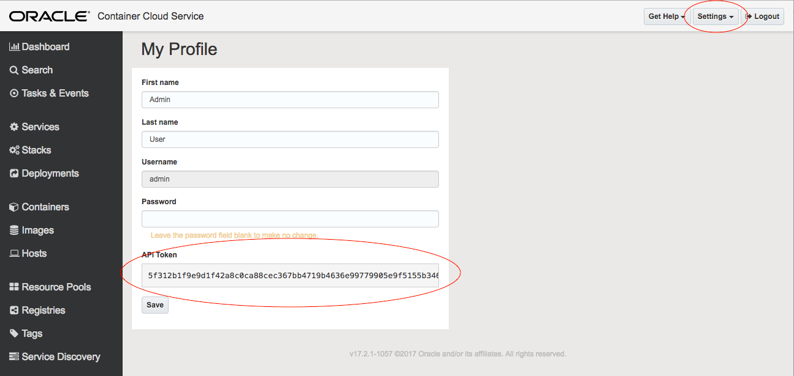

# The OCCS rollingupdate tool install script

### Usage: 
<pre>sh create_stacks.sh admin-host-adress bearer haproxy-server-address</pre>
<ul>
<li>admin-host-adress is the OCCS admin node IP address or name</li>
<li>bearer is the OCCS admin API token / bearer (see below)</li>
<li>haproxy-server-address is the worked node IP address or name where the HAproxy Docker lives in as part of the stack</li>
</ul>

### API token / bearer can be found in OCCS here:

### Example:
<pre>sh create_stacks.sh 129.15.69.55 5f312b1f9e9d1f42a8c0ca88cec3675ytfd4636e99779905e9f5155b346a07</pre>

## Architecture

Rollingupdate tool installer creates two Dockers:
<ul>
<li>the sample dockernode app stack for testing that runs in port 80</li>
<li>the rollingupdate tool running in port 1000 that enables doing rolling updates visually against the OCCS instance and the sample application</li>
</ul>

Rollingupdate tool uses both OCCS REST and the HAProxy socket on volume /tmp using the netcat ('nc') tool (A in the picture below). Since the socket is shared between the HAproxy and the rollingupdate tool it is expected to be run on the same VM as the HAProxy in the app stack (these can be pinned to be run in the same VM in OCCS when running multiple VM's).

Rollingupdate tool can be used to do scaling in/out and rolling updates for any app stack that contains the HAproxy (B in the picture below). It works even if the HAproxy socket is not accessible by the rollingupdate tool (user gets notified when so).  

Example config of the Oracle OCCS HAproxy used in this stack configuration found <a href="https://github.com/mikarinneoracle/docker-images/blob/master/ContainerCloud/images/haproxy/haproxy.cfg.template_orig">here</a>.

It is also recommended the application uses sessions for session infinity and that HAproxy is configured properly to use them. The Dockers installed here use Node.js default sessions. Source code for the sample app <a href="https://github.com/mikarinneoracle/dockernode-app">here</a>.

Video for running the rolling update tool agains the sample app found <a href="https://www.youtube.com/watch?v=cags1HnRHZM">here</a>.

